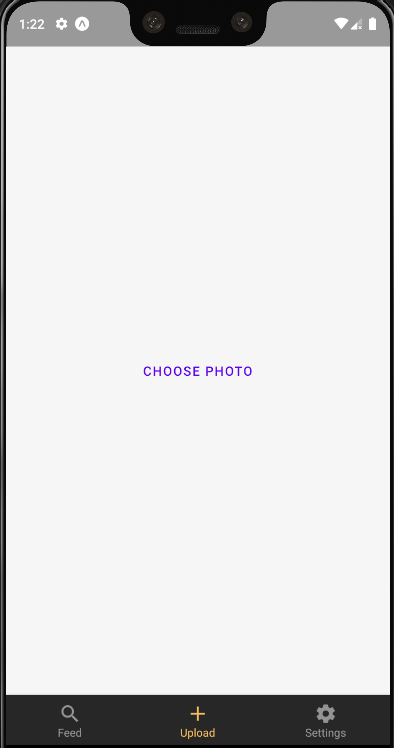
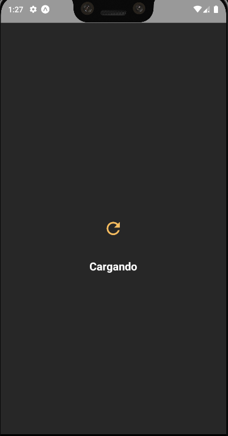
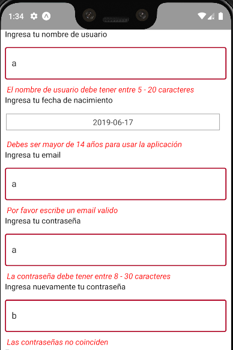

# Sprint 3

### Dependencias instaladas

- prop-types
- redux-thunk
- redux-logger
- react-native-pdf

### Reporte de avance

####1.  Finalización de Redux 
El tercer sprint termina la implementación de Redux en la aplicación 

####2. Subida de archivos y envío a Backend
La subida de archivos está implementada para la subida de memes (aka. imágenes de menos de 3Mb de tamaño). 

####3. Avisos de Confirmación
Se implementaron vistas de carga para el login, la confirmación del signup, la confirmación del envío de confirmación al email y subida de los memes.

####4. Validación de los campos
Los campos de la forma de registro están siendo validados antes de enviarse a back.

####5. Consumo de endpoint para Flujos
La aplicación aplica las implementaciones de login de Google y Facebook.

