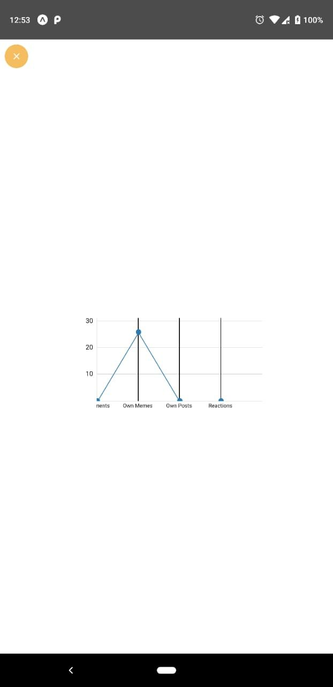
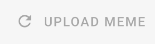

# Sprint 4

### Dependencias instaladas

- expo-facebook

### Reporte de avance

####1. Finalización de Facebook Login
Se terminaron los esfuerzos para completar el flujo de autenticación usando los tokens de Facebook.

####2. Implementación de visualización de métricas
La implementación de visualización de gráficas esta dispuesta en la vista de configuración de la aplicación

####3. Avisos de Confirmación
Se implementaron vistas de carga para el login, la confirmación del signup, la confirmación del envío de confirmación al email y subida de los memes.

####4. Backbone de post view
La aplicación ahora tiene una vista fija para la visualización al tocar los memes en el feed.